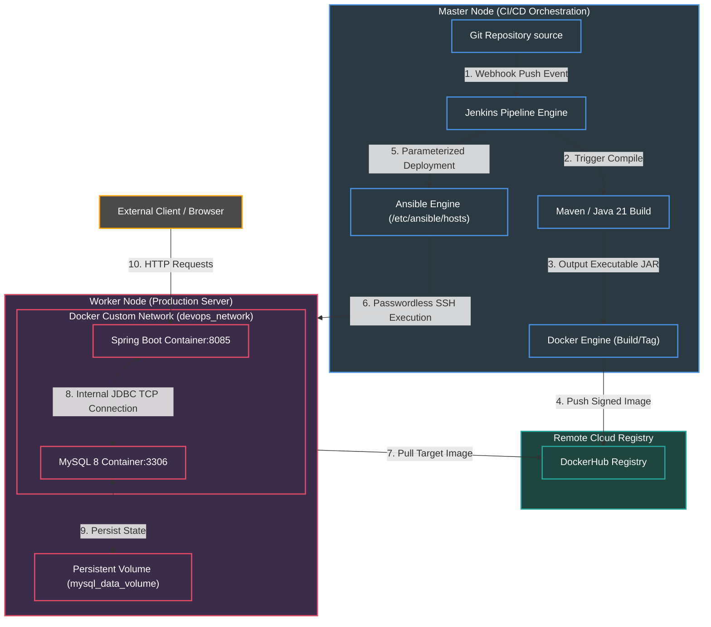

# 🚀 Enterprise Real-World End-to-End DevOps CI/CD Showcase Project

[](https://oracle.com/java)
[](https://spring.io/projects/spring-boot)
[](https://www.docker.com/)
[](https://www.jenkins.io/)
[](https://www.ansible.com/)
[](https://www.mysql.com/)

A production-ready, highly professional **End-to-End DevOps CI/CD pipeline architecture** implementing real-world containerized microservice workflows. Built with **Spring Boot (Java 21)**, managed through **Maven**, containerized securely via **Docker**, orchestrated using **Ansible**, and completely automated end-to-end via a parameterized **Jenkins** pipeline pushed to **DockerHub**.

---

## 📑 Table of Contents
1. [Project Overview](#1-project-overview)
2. [Architecture Diagram](#2-architecture-diagram)
3. [CI/CD Workflow & Deployment Flow](#3-cicd-workflow--deployment-flow)
4. [Tools & Technologies Used](#4-tools--technologies-used)
5. [Security Best Practices](#5-security-best-practices)
6. [Installation & Setup Steps](#6-installation--setup-steps)
7. [Step-by-Step Deployment Guide](#7-step-by-step-deployment-guide)
8. [Screenshots Section](#8-screenshots-section)
9. [Troubleshooting Guide](#9-troubleshooting-guide)
10. [Future Improvements](#10-future-improvements)

---

## 1. 🌟 Project Overview

This repository demonstrates the end-to-end deployment lifecycle of an Enterprise REST API microservice communicating with a containerized relational database backend.

### Master Node Infrastructure:
Contains developer tools, orchestration engines, and continuous integration controllers:
- **Git** for distributed source code tracking.
- **Java 21 & Maven** for application compilation and artifact generation.
- **Docker Engine** for building lightweight application images.
- **Jenkins CI Server** orchestrating build stages, credentials management, and remote triggers.
- **Ansible Automation Engine** connecting directly to target infrastructure via SSH.

### Worker Node Infrastructure:
Target isolated production server operating containerized units:
- **Spring Boot Application Container** exposed securely on port `8085`.
- **MySQL 8 Database Container** operating securely on port `3306`.
- **Custom Docker Bridge Network** providing secure, internal DNS name resolution between containers without exposing database traffic publicly.

---

## 2. 🏛️ Architecture Diagram

The comprehensive multi-node infrastructure overview demonstrating inter-communication paths, credential helpers, and deployment vectors.



---

## 3. 🔄 CI/CD Workflow & Deployment Flow

The end-to-end continuous integration and delivery lifecycle operates perfectly through declarative stages defined inside the `Jenkinsfile`.

1. **GitHub Push Event**: A code commit to the main branch triggers Jenkins via GitHub Webhooks.
2. **Maven Build Phase**: Jenkins pulls source files, sets up environment variables, and executes `mvn clean package -DskipTests` to package the Java 21 Spring Boot microservice executable JAR.
3. **Docker Image Creation**: Jenkins invokes the local Docker engine to execute instructions inside `Dockerfile`. A non-root application image is created using an ultra-lightweight Alpine Base JRE layer.
4. **Secure Image Tagging**: Images are tagged dynamically combining build variables (`${BUILD_NUMBER}`) and rolling releases (`latest`).
5. **DockerHub Push Integration**: Jenkins reads credentials dynamically securely via declarative helpers (`withCredentials`) and pushes the pristine application layers to DockerHub.
6. **Local Node Cleanup**: Built intermediate images on the master node are dropped cleanly using `docker rmi` to prevent filesystem saturation.
7. **Ansible Orchestration Execution**: Jenkins delegates remote container setup to Ansible playbooks running locally over SSH.
8. **Live Liveness Access**: The container spins up inside `devops_network`, resolves database connection details via internal Docker DNS, runs SQL migrations using Hibernate auto-ddl, and serves external REST web traffic on port `8085`.

---

## 4. 🛠️ Tools & Technologies Used

| Tool | Version | Responsibility |
| :--- | :--- | :--- |
| **Ubuntu Linux** | `24.04 LTS` | Host Operating Systems for Master & Worker servers |
| **Java** | `JDK 21` | High-performance enterprise programming language |
| **Spring Boot** | `3.3.0` | Backend API microservice framework |
| **Apache Maven** | `3.9.x` | Dependency compilation and build management |
| **MySQL** | `8.0` | Highly resilient relational database backends |
| **Docker Engine** | `Latest` | Immutable multi-stage container deployment engines |
| **Jenkins** | `Latest` | Continuous integration engine and job management |
| **Ansible** | `Latest` | Push-based zero-agent infrastructure provisioning |
| **Git / GitHub** | `Latest` | Distributed version control tracking |

---

## 5. 🔒 Security Best Practices

> [!CAUTION]
> **Production Secrets Containment**: Hardcoding connection strings, repository credentials, or private access keys directly inside revision history presents critical attack surfaces. This architecture enforces standard secrets isolation.

- **Jenkins Credentials Stores**: Secret credentials like DockerHub password keys are maintained securely inside encrypted Jenkins stores and unmasked transparently only inside specific command memory scopes.
- **Environment Variable Binding**: Database connection credentials inside `application.properties` reference host environment variables (`${SPRING_DATASOURCE_PASSWORD}`) passed securely by Ansible during container spin-up.
- **SSH Key Authentication**: The Ansible controller authenticates with remote infrastructure strictly utilizing public/private cryptographic key pairs instead of plain text password prompts.
- **Least-Privilege Docker Users**: The application container creates and switches execution context to an unprivileged custom system user (`devopsuser`), isolating container runtimes against zero-day host escalations.
- **Internal Bridged Networking**: Database port maps are closed from WAN interfaces and communicate exclusively over private container interface paths using native Docker overlay DNS.

---

## 6. ⚙️ Installation & Setup Steps

For granular, end-to-end command line setups on clean bare-metal or cloud instances, refer to the dedicated Linux Setup Guide:
👉 **[LINUX_SETUP_COMMANDS.md](./LINUX_SETUP_COMMANDS.md)**

---

## 7. 🚀 Step-by-Step Deployment Guide

Follow this systematic guide to launch the entire stack starting from absolute zero.

### Phase 1: Environment Preparation
1. Setup Master and Worker node servers running Ubuntu 24.04.
2. Follow instructions in `LINUX_SETUP_COMMANDS.md` to install Git, Docker, Jenkins, Java 21, Maven, and Ansible on the Master node. Install Docker on the Worker node.
3. Configure passwordless SSH from the `jenkins` user on the Master node to the target user on the Worker node.
4. Populate your Ansible Inventory configuration in `/etc/ansible/hosts` (or project local inventory path) mapping the Worker Node internal/external IP addresses.

### Phase 2: Jenkins Pipeline Setup
1. Open Jenkins UI dashboard inside your web browser (`http://<master-ip>:8080`).
2. Navigate to **Manage Jenkins** -> **Credentials** -> **System** -> **Global credentials** -> **Add Credentials**.
   - **Kind**: Username with password
   - **Scope**: Global
   - **Username**: `<your-dockerhub-username>`
   - **Password**: `<your-dockerhub-access-token>`
   - **ID**: `dockerhub-creds` (Must precisely match Jenkinsfile declarations)
3. Return to dashboard, click **New Item**, enter `Enterprise-DevOps-Pipeline`, select **Pipeline**, click **OK**.
4. Scroll to **Pipeline Definition**, choose **Pipeline script from SCM**, choose **Git**, enter your target GitHub URL containing this project source repository. Set Script Path to `Jenkinsfile`. Save configurations.

### Phase 3: Trigger Continuous Delivery Execution
1. Click **Build with Parameters** on the job sidebar.
2. The UI renders available operational checkboxes:
   - `DEPLOY_DB`: Check to initialize database tiers.
   - `DEPLOY_APP`: Check to deploy active application tier.
   - `UPDATE_APP`: Check when pushing zero-downtime microservice rolling updates.
   - `REMOVE_APP` / `REMOVE_DB`: Maintenance commands to drop services clean.
3. Click **Build**. Trace real-time log outputs directly inside **Console Output** views.

### Phase 4: Application Testing & Validation
Once the execution stream concludes with success output blocks, navigate to your favorite web browser or terminal API utility to query health:

```bash
# Query active health probe status
curl -X GET http://<worker-node-ip>:8085/api/products/status

# Output json validation confirms operational statuses:
# {
#   "status": "SUCCESS",
#   "message": "Spring Boot DevOps App is Running Perfectly on Port 8085",
#   "databaseConnected": true,
#   "totalProducts": 0
# }
```

---

## 8. 📸 Screenshots Section

To build trust and verify continuous visual success representations, insert production capture artifacts here:

- **Jenkins Parameters Configuration Screen**:
  > Displays pristine customized boolean options triggering conditional deployment actions.
  
- **Jenkins Blue Ocean Stage View**:
  > Visualizes flawless pipeline completion sequences (Build -> Tag -> Push -> Cleanup -> Deploy DB -> Deploy App).

- **Terminal Telemetry Output**:
  > Displays `docker ps` confirmation blocks operating active containers bounded to `devops_network`.

- **Browser Liveness Validation**:
  > Renders rich JSON arrays containing database queries returning active entities successfully.

---

## 9. 🩺 Troubleshooting Guide

Common real-world friction vectors encountered during continuous deployment cycles along with actionable resolution protocols.

### 🔴 Issue 1: Jenkins Permission Denied Calling Docker Socket
**Symptom**: Jenkins console output throws errors matching `Got permission denied while trying to connect to the Docker daemon socket at unix:///var/run/docker.sock`.
**Root Cause**: The Jenkins system service user runs without ownership access rights inside the host `docker` group.
**Resolution**:
```bash
sudo usermod -aG docker jenkins
sudo systemctl restart jenkins
```

### 🔴 Issue 2: Ansible Host Key Verification Failed
**Symptom**: Stage execution fails displaying `Host key verification failed. fatal: [workernodes]: UNREACHABLE!`.
**Root Cause**: SSH strict host checking prompts require interactive yes/no string approvals during initial machine handshakes.
**Resolution**:
Update Ansible inventory arguments passing strict security bypass flags as seen inside our configuration template:
```ini
ansible_ssh_common_args='-o StrictHostKeyChecking=no'
```

### 🔴 Issue 3: Spring Boot Application Fails Starting with CommunicationsException
**Symptom**: Container logs output `com.mysql.cj.jdbc.exceptions.CommunicationsException: Communications link failure`.
**Root Cause**: Application boots faster than MySQL completes storage volume metadata allocations, or containers operate across incompatible external networking scopes.
**Resolution**:
Verify container networks match exactly (`docker inspect devops_network`). Ensure standard JDBC URI configurations append extra parameters supporting legacy network handshakes:
```properties
allowPublicKeyRetrieval=true&useSSL=false
```

---

## 10. 🔮 Future Improvements

Continuous infrastructure engineering roadmap expansion points suitable for production enhancements:

- **Kubernetes Migration**: Replace plain Docker container runtimes with target Kubernetes manifests managed via Helm charts for advanced load balancing, horizontal auto-scaling, and pod self-healing.
- **Infrastructure as Code Integration**: Implement Terraform scripts to declaratively instantiate AWS EC2 compute units dynamically before delegating provisioning pipelines to Ansible.
- **Prometheus/Grafana Telemetry**: Implement Spring Boot Actuator metric ingestion endpoints mapped directly into visual dashboard engines observing container memory saturation and thread request response timelines.
- **Static Code Security Scanning**: Add integrated SonarQube quality gating inside the Jenkinsfile preventing pipeline pushes if test unit lines fall below set coverage threshold ratios.

---
*Architected and developed with care by a Passionate Senior DevOps System Engineer.*
